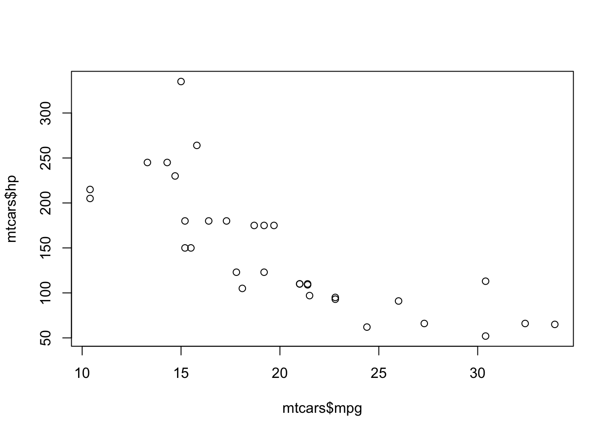

This is an example script that will be run by `render_file` and logged in 
the logbook.

::: {.callout-note}
Note that there are five types of callouts, including:
`note`, `warning`, `important`, `tip`, and `caution`.
:::


::: {.cell}

```{.r .cell-code}
library(tidyverse, warn.conflicts = FALSE)
library(fixest)
```
:::

::: {.cell}

```{.r .cell-code}
1 + 1
mean(rnorm(1000))
```

::: {.cell-output .cell-output-stdout}

```
[1] 2
[1] -0.03452145
```


:::
:::


## Plots


::: {.cell}

```{.r .cell-code}
plot(mtcars$mpg, mtcars$hp)
```

::: {.cell-output-display}
{width=672}
:::
:::


## Tables


::: {.cell}

```{.r .cell-code}
knitr::kable(
  mtcars[1:5, ], 
  caption = "A knitr kable."
)
```

::: {.cell-output-display}


Table: A knitr kable.

|                  |  mpg| cyl| disp|  hp| drat|    wt|  qsec| vs| am| gear| carb|
|:-----------------|----:|---:|----:|---:|----:|-----:|-----:|--:|--:|----:|----:|
|Mazda RX4         | 21.0|   6|  160| 110| 3.90| 2.620| 16.46|  0|  1|    4|    4|
|Mazda RX4 Wag     | 21.0|   6|  160| 110| 3.90| 2.875| 17.02|  0|  1|    4|    4|
|Datsun 710        | 22.8|   4|  108|  93| 3.85| 2.320| 18.61|  1|  1|    4|    1|
|Hornet 4 Drive    | 21.4|   6|  258| 110| 3.08| 3.215| 19.44|  1|  0|    3|    1|
|Hornet Sportabout | 18.7|   8|  360| 175| 3.15| 3.440| 17.02|  0|  0|    3|    2|


:::
:::


## Regression


::: {.cell}

```{.r .cell-code}
est = feols(mpg ~ hp | cyl, mtcars)
```
:::

::: {.cell}

```{.r .cell-code}
esttable(est)
```

::: {.cell-output .cell-output-stdout}

```
                             est
Dependent Var.:              mpg
                                
hp              -0.0240 (0.0153)
Fixed-Effects:  ----------------
cyl                          Yes
_______________ ________________
S.E.: Clustered          by: cyl
Observations                  32
R2                       0.75386
Within R2                0.07998
---
Signif. codes: 0 '***' 0.001 '**' 0.01 '*' 0.05 '.' 0.1 ' ' 1
```


:::
:::
